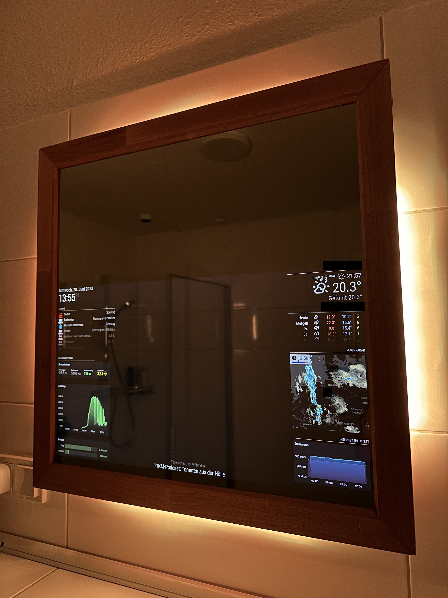

# DIY Smart Mirror using Chromecast + HomeKit integration

This is a step-by-step walkthrough on how i build up my own smart mirror. Please feel free to ask questions or to give me feedback :-) 

## Index 
* [**Introduction**](#introduction)
* [Requirements](#requirements)
* [Block diagram](#block-diagram)
---
* [**Step 1: Part selection**](#step-1-part-selection)
* [**Step 2: Fusion 360 Design**](#step-2-fusion-360-design)
* 
---
* [**Step 3: Mechanical assembly**](#step-3-mechanical-assembly)
* [Step 3.1: Building the Frame](#step-31-building-the-frame)
* [Step 3.2: Integrating the mirror glas](#step-32-integrating-the-mirror-glas)
---
* [**Step 4: Electrical assembly**](#step-4-electrical-assembly)
* [Step 4.1: Prepare the monitor](#step-41-prepare-the-monitor)
* [Step 4.2: Prepare the nanoleaf RGB stripe](#step-42-prepare-the-nanoleaf-rgb-stripe)
* [Step 4.3: Connecting and test switching relay for monitor](#step-43-connecting-and-test-switching-relay-for-monitor)
---
* [**Step 5: Integrate electronic inside the frame**](#step-5-integrate-electronic-inside-the-frame)
* [Step 5.1: 3D printing accessories](#step-51-3d-printing-accessories)
* [Step 5.2: Sealing backside](#step-52-sealing-backside)
* [Step 5.3: Install wall mount](#step-53-install-wall-mount)
---
* [**Step 6: Hang up and first test**](#step-6-hang-up-and-first-test-)
* [*Problem 1: Sealing backside not sufficient*](#problem-1-sealing-backside-not-sufficient)
---
* [**Step 7: Software**](#step-7-software)
* [Step 7.1: Set-up MagicMirror2](#step-72-set-up-chrome-and-start-casting)
* [Step 7.2: Set-up Chrome and start casting](#step-72-set-up-chrome-and-start-casting)
* [*Problem 2: Casting to chromecast is bad*](#problem-2-casting-to-chromecast-is-bad)
* [Step 7.3: Set-up browser on chromecast](#step-73-set-up-browser-on-chromecast)
* [*Problem 3: Browser on chromecast crashes randomly*](#problem-3-browser-on-chromecast-crashes-randomly)
* [Step 7.4: Set-up DashboardScreensaver app](#step-74-set-up-dashboardscreensaver-app)
* [*Problem 4: Chromecast comes back to homescreen randomly*](#problem-4-chromecast-comes-back-to-homescreen-randomly)
* [Step 7.5: Chromecast work-around](#step-75-chromecast-work-around)
---
* [**Conclusion**](#conclusion)
* [Bill of materials](#bill-of-materials)

## Introduction
## Requirements
## Block diagram
# Step 1: Part selection
# Step 2: Fusion 360 Design

# Step 3: Mechanical assembly
## Step 3.1: Building the Frame
## Step 3.2: Integrating the mirror glas
# Step 4: Electrical assembly
## Step 4.1: Prepare the monitor
## Step 4.2: Prepare the nanoleaf RGB stripe
## Step 4.3: Connecting and test switching relay for monitor
# Step 5: Integrate electronic inside the frame
## Step 5.1: 3D printing accessories
## Step 5.2: Sealing backside
## Step 5.3: Install wall mount
# Step 6: Hang up and first test 
## Problem 1: Sealing backside not sufficient
# Step 7: Software
## Step 7.1: Set-up MagicMirror2 
## Step 7.2: Set-up Chrome and start casting
## Problem 2: Casting to chromecast is bad
## Step 7.3: Set-up browser on chromecast
## Problem 3: Browser on chromecast crashes randomly
## Step 7.4: Set-up DashboardScreensaver app
## Problem 4: Chromecast comes back to homescreen randomly
## Step 7.5: Chromecast work-around
# Conclusion
# Bill of materials

